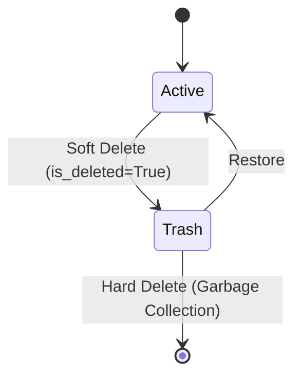

# Application Flow (APP_FLOW.md)

## 1. Ingestion Flow (The Entry)

```mermaid
graph TD
    User[User @ Browser] -->|Click Ext Icon| Ext[Chrome Extension]
    Ext -->|Select Tags (Optional)| Ext
    Ext -->|POST /api/v1/ingest| API[FastAPI Gateway]
    
    subgraph "Ingestion Pipeline"
        API -->|Validate JWT| Auth[Auth Guard]
        Auth -->|Pass| Q[Redis Queue: 'ingest_tasks']
        Q -->|Pop| Worker[Celery Worker (NAS)]
    end
    
    Worker -->|1. Try Fetch| Http{Trafilatura}
    Http -->|Success| Clean[Clean Text]
    Http -->|Fail (403/JS)| Browser{Playwright}
    Browser -->|Success| Clean
    Browser -->|Fail| Error[Mark Status: FAILURE]
    Error -->|Notify| User
```

## 2. Intelligence Flow (The Processing)

```mermaid
graph TD
    Input[Clean Text] -->|Input| Classifier[Tiny Model (CPU Classification)]
    Classifier -->|Output Class| Router{Switch Case}
    
    Router -->|'Article'| AgentA[Editorial Agent]
    Router -->|'Code'| AgentB[Tech Agent]
    Router -->|'Product'| AgentC[Shopping Agent]
    
    subgraph "Hybrid Inference"
        AgentA & AgentB & AgentC -.->|API Call| LLM_Gateway
        LLM_Gateway -->|Config: Cloud| Cloud[DeepSeek API]
        LLM_Gateway -->|Config: Local| GPU[Remote PC (Ollama)]
    end
    
    Cloud & GPU -->|Structured JSON| Saver[DB Saver]
    Saver -->|Metadata| PG[(PostgreSQL)]
    Saver -->|Vector Vectors| Chroma[(ChromaDB)]
```

## 3. Data Lifecycle


